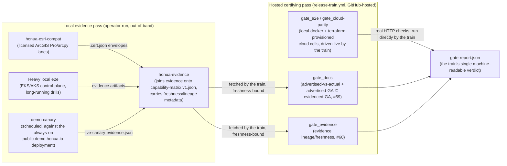

# The Hybrid Train

Companion to [`RELEASE-ENGINEERING-PLAN.md`](RELEASE-ENGINEERING-PLAN.md) and
[`TEST-STRATEGY.md`](TEST-STRATEGY.md). Written for the release-safety program
(epic honua-io/honua-release#58), specifically its P4 child (#61: cloud tier unblock + live
capability-manifest check + scheduled demo canary), after two decisions from the release owner
changed the shape of the train:

1. **honua-esri-compat's evidence is produced LOCALLY** (licensed ArcGIS Pro/arcpy) and must be
   **consumed** by the certification gate with a freshness bound — never executed in-train
   (honua-io/honua-release#61, comments).
2. **The release train is HYBRID**: some lanes run hosted (GitHub-hosted runners, OIDC-federated
   cloud creds), some lanes run locally (an operator's licensed/credentialed environment), and the
   train's job is to *certify against evidence*, not to *be* every lane itself.

This document names that model explicitly so future gates are designed consistently with it,
instead of every new evidence source re-litigating "does this run in CI or not."

## The two-pass model

**Local evidence pass.** Producers that need something the train's hosted runners genuinely cannot
have — a licensed desktop toolchain (ArcGIS Pro), a persistent deployment the train doesn't own
(the public demo), or a cadence too expensive/slow for a release cut (EKS/AKS control-plane spin-up,
DR drills) — run **out-of-band**, on their own schedule, in their own environment. They **push a
versioned evidence envelope** (a `.cert.json`, a `capability-matrix.v1.json` producer entry, a
`live-canary-evidence.json`) somewhere the hosted pass can fetch it.

**Hosted certifying pass.** `release-train.yml` runs on GitHub-hosted runners with OIDC-federated
cloud creds (no static secrets) and is the **one and only** trigger surface for cutting a release
candidate (AGENTS.md: "Both humans and AI use this one workflow_dispatch"). It does two different
things depending on the lane:
- For lanes it CAN run itself (canonical checks, terraform-provisioned cloud cells, contract/SBOM/
  security scans) — it runs them **for real**, live, every cut.
- For lanes that only exist as local evidence (esri-compat, demo-canary, DR drills) — it **consumes**
  the pushed envelope with an explicit **freshness bound** (`certification/evidence-freshness.yaml`,
  `tools/check_evidence_freshness.py`, honua-release#60) and a **lineage check** (is this evidence
  actually about the candidate's pinned commit, not a stale/unrelated snapshot?). Missing, stale, or
  lineage-diverged evidence is `blocked` (bootstrap) / `fail` (a real cut) — **never a fake pass**.

The esri-compat consumption model set the pattern (see the honua-io/honua-release#61 issue comments):
committed/pushed `.cert.json` envelopes carry a timestamp + the target server SHA/URL; the
certification gate's `conformance-esri-geoservices` lane *reads* that evidence rather than executing
the licensed toolchain in-train. `demo-canary.yml` (this PR) follows the identical shape for the live
demo-deployment proof: it runs on its own 6-hour schedule against `https://demo.honua.io`, independent
of any specific release candidate, and writes a versioned `live-canary-evidence.json` envelope for
honua-evidence to join — it is deliberately **not** wired as a `release-train.yml` gate job, because
the public demo is a persistent, always-on deployment, not an ephemeral per-candidate cell the train
provisions and tears down.

## What's genuinely hosted vs. genuinely local today

| Lane | Where it runs | Why |
|---|---|---|
| Canonical slim set + live capability-manifest check (`e2e/canonical_checks.py`) | **Hosted**, per cloud cell, live | Plain HTTP checks against a target the train just provisioned — no license, no persistent state needed. |
| Cloud-tier canary probes (`e2e/canary_probes.py`, generic mode) | **Hosted**, per cloud cell, live | Same — reachability-only probes run for real; probes needing seeded data honestly BLOCK on a bare cell (no seed-data story yet — a gap, not a lie). |
| Terraform parity cells (aws-serverless/ecs/eks) | **Hosted**, OIDC into AWS | `e2e-cloud-aws.yml`; self-skips `cloud-creds-unset` until `HONUA_AWS_ROLE_ARN` is wired. |
| MCP/Studio/GP-execute/top-demo extended scenarios | **Neither yet** — hardcoded `blocked` | Needs the driver toolchain packaged as a harness image (honua-release#35). Not a hybrid-lane decision; a genuine gap. |
| honua-esri-compat (ArcGIS Pro/arcpy render/edit/3D lanes) | **Local**, operator's licensed Windows environment | ArcGIS Pro licensing cannot run on a GitHub-hosted runner. Consumed via `.cert.json` + freshness bound. |
| honua-esri-compat (license-free: `arcgis` Python, .NET metadata, raw REST) | Could run **either** place | No license dependency, but currently ships as part of the same local evidence producer; a future PR could promote these specific lanes to hosted-live (see honua-io/honua-release#61 issue comment on `conformance-esri-geoservices`). |
| demo-canary (`.github/workflows/demo-canary.yml`) | **Local-by-schedule** (hosted runner, but targets the persistent public demo, not a train-provisioned cell) | The demo is a standing deployment the train doesn't own or tear down; it is evidence *about* a live environment, not a certifying check *of* the candidate being cut. |
| Terraform DR drills (honua-terraform) | **Local**, its own runbook cadence | DR drills are expensive/slow and target real backup infrastructure; captured via `dr-evidence-template.json` (honua-io/honua-evidence#8). |

## Release-1 `ALLOWED_SKIP` (program pillar P5 — first-release bootstrap honesty)

Epic #58 names P5 explicitly: *"Document the release-1 `ALLOWED_SKIP` set explicitly (upgrade-gate
baseline, consciously skipped creds-gated tiers) so the first promote is fail-closed on everything
else."* This is that list, for the first real (non-dry-run) train cut:

| Item | Why it's allowed to skip release-1 | Tracked by |
|---|---|---|
| `gate_upgrade` kind-smoke (prior-release → candidate) | There is no prior GA release yet to upgrade *from* — the upgrade gate needs a baseline manifest that doesn't exist before release-1 ships. | `certification/evidence-freshness.yaml`-style: this is a one-time bootstrap gap, not a recurring skip — release-2's cut has a real baseline and this row should be deleted. |
| `gate_e2e` / `gate_cloud-parity` extended scenarios (MCP/Studio/GP-execute/top-demo) | Blocked on the cloud harness image, a genuine build gap, not a policy choice. | honua-release#35 |
| Cloud-tier data-dependent canary probes (render+query smoke, per-service WMS/WMTS/WCS, tile.json) against a bare terraform-provisioned cell | No seed-data provisioning story for ephemeral cloud cells yet — legitimately unprovable, reported `blocked`, not faked. | Follow-up to honua-release#61 (not yet filed as its own issue — seed-data-on-provision is a natural next increment once #35's harness image work is scoped). |
| `gate_evidence` CITE-freshness producer | honua-evidence has not yet landed per-suite CITE freshness metadata in `capability-matrix.v1.json`'s `freshness` block. | honua-io/honua-evidence#8 |
| `conformance-esri-geoservices` license-free lanes as a LIVE (not evidence-consumed) check | Currently ships only via the local esri-compat evidence producer; promoting the license-free subset to a hosted-live check is a candidate follow-up, not release-1 scope. | honua-io/honua-release#61 issue comment |
| Demo-canary's key-gated probes (metrics, admin-metrics-health, deploy-preflight, capability-manifest `available=true`) | `HONUA_DEMO_API_KEY` is an optional secret; without it these honestly report `blocked`. | Wire the secret (see below) to promote these to live pass/fail. |

Everything **not** in this table is fail-closed from release-1: a capability advertised GA without
qualifying evidence fails `gate_docs`; a stale/lineage-diverged evidence matrix fails `gate_evidence`;
a genuine (not merely unseeded) HTTP failure on a provisioned cloud cell or the demo canary reddens
its run. The `ALLOWED_SKIP` set is deliberately small and named — anything added to it later needs
the same "why, and who owns closing it" treatment as the rows above, per AGENTS.md ("a gate that
can't fail is worse than no gate" applies just as much to an ever-growing skip list as to a gate with
no teeth).

## Coordination point: honua-io/honua-evidence#8

Evidence#8's producer contract landed in honua-io/honua-evidence#9
(`docs/producer-contracts.md`: schema `honua-evidence.live-canary-envelope/v1`, pushed as one file
per run into that repo's `data/producers/live-canary/`). `demo_canary.py` emits that schema
directly: required fields `schema` / `manifestId` / `targetEnvironment` / `runAt` / `probes`, with
each probe carrying `probeName`, non-empty `capabilityKeys` (the mapping to capability-matrix keys
lives in `demo_canary.PROBE_CAPABILITY_KEYS` — only mapped, non-blocked results become evidence
probes; the full check list stays in the gate report), `status` (`green`/`red`), and `lastGreenAt`.
The envelope also carries `candidateServerSha` as a tolerated extra field so the pinned-candidate
lineage stays traceable. The canary workflow commits each versioned envelope directly into
honua-evidence's `data/producers/live-canary/` landing zone; the evidence aggregate then records the
producer as `fresh`, `stale`, or `missing` from those delivered artifacts.
